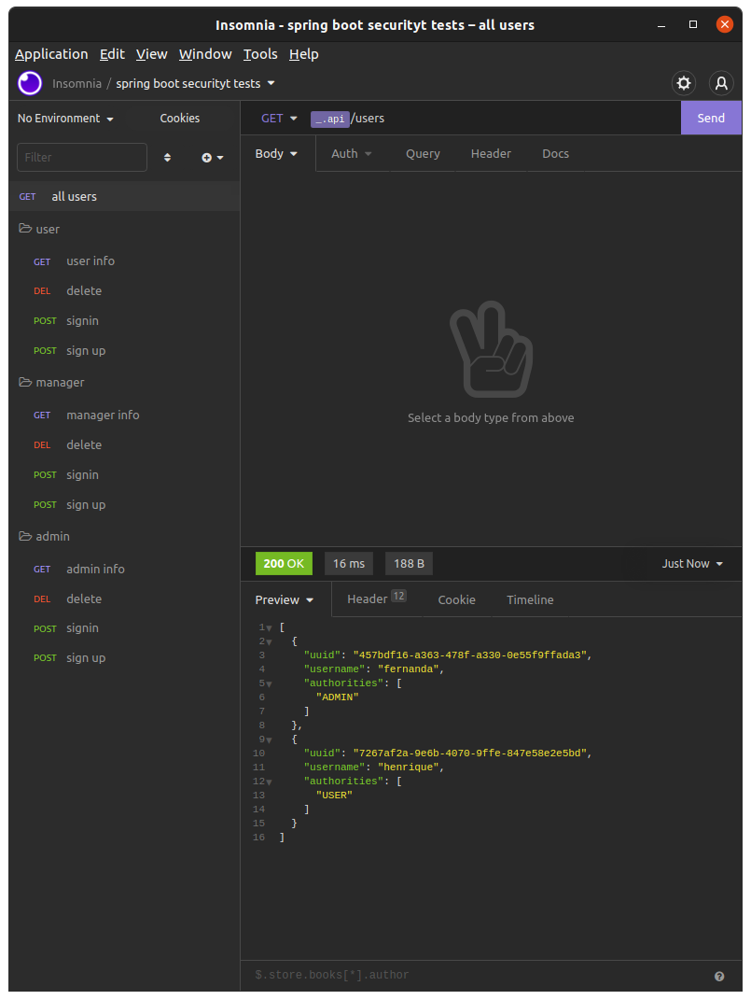

# Rest api com autenticação jwt

    Aplicação feita com o intuito de aprender o básico sobre autenticação no spring security.

### Referencias

* [devglan - exception handling in spring security](https://www.devglan.com/spring-security/exception-handling-in-spring-security#/google_vignette)
* [devglan - jwt role based authorization](https://www.devglan.com/spring-security/jwt-role-based-authorization)

* [mkyong - spring rest validation example](https://mkyong.com/spring-boot/spring-rest-validation-example/)

### Screeshots

### Guias
requisitos: 
    
    java version 17
    mysql
    
para testar:

     mvn spring-boot:run

para usar no insomnia:

    importe o arquivo: Insomnia_2022-04-21.json